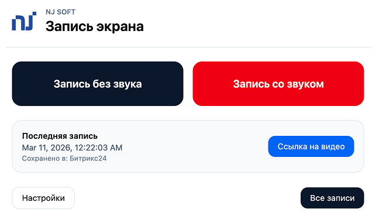
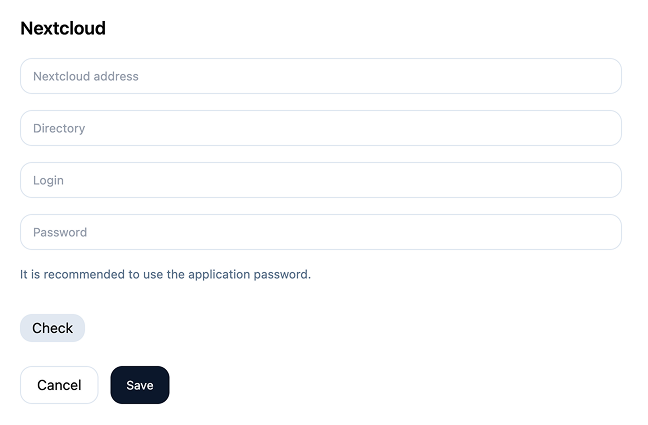

# NJ Screencast - free, safe and easy solution for screen recording in Chrome.
Extension for chrome/chromium browser

## This extension allows you to:
- Record your desktop with or without sound
- Select codec (webm/vp8/vp9/h264 or mpeg)
- Save files locally or to your own server Nextcloud

## How to install and setup ?

#### Install from web store

[Link to install ](https://chromewebstore.google.com/detail/nj-screencast-%D0%B7%D0%B0%D0%BF%D0%B8%D1%81%D1%8C-%D1%8D%D0%BA%D1%80%D0%B0/lpahdblhaaaociedcbjkaechgehhlogh)

#### Install from git

- Do git clone or download zip (if it zip then unpack it)
- In your browser open [chrome://extensions](chrome://extensions) and enable developer mode then load unpacked
- Select unpacked (or cloned) dir and pin it from extensions icon near omnibox.
- To setup nextcloud uploading click on extension icon and click Settings and fill the form. Please use application password ( /settings/user/security )

## How it works?
Extension uses [MediaStream recording API](https://developer.mozilla.org/en-US/docs/Web/API/MediaStream_Recording_API) and library [ts-ebml](https://github.com/legokichi/ts-ebml) for extract duration information after finish capture. If nextcloud settings enabled, video will upload to server through [webdav](https://docs.nextcloud.com/server/latest/developer_manual/client_apis/WebDAV/basic.html). It's important to use application password.

### Screenshots 

### Donations

If you like it and want to say thanks, [donations](https://donate.stripe.com/3cseYI2OQ8J0aOI288) are welcome.

---

# NJ Screencast - бесплатное, безопасное и простое решение для записи экрана.
Данное расширение устанавливается в браузер chrome или chromium.

## Данное расширение позволит вам:
- Записывать десктоп со звуком или без звука
- Использовать разнообразные кодеки (webm/vp8/vp9/h264 или mpeg)
- Сохранять файлы локально или на ваш сервер Nextcloud

## Как установить и настроить?

#### Установить из магазина расширений

[Ссылка на расширение в магазине](https://chromewebstore.google.com/detail/nj-screencast-%D0%B7%D0%B0%D0%BF%D0%B8%D1%81%D1%8C-%D1%8D%D0%BA%D1%80%D0%B0/lpahdblhaaaociedcbjkaechgehhlogh)

#### Установить из репозитория

- Скачать репозиторий (git clone) или архив репозитория (zip и распаковать его).
- В браузере открыть управление расширениями [chrome://extensions](chrome://extensions) и включить Режим разработчика, затем нажать на кнопку Загрузить распакованное расширение
- Выбрать распакованную или склонированную папку расширения
- Для настройки соединения с вашим Nextcloud сервером, нужно нажать на кнопку Настройки и заполнить форму. Необходимо использовать пароль приложения  ( /settings/user/security ) иначе загрузка в Nextcloud через webdav не будет работать.

## Как это работает?
Расширение использует [MediaStream recording API](https://developer.mozilla.org/en-US/docs/Web/API/MediaStream_Recording_API) и библиотеку [ts-ebml](https://github.com/legokichi/ts-ebml) для добавления информации длительности видеофайла после завершения записи. Связь с Nextcloud работает через [webdav](https://docs.nextcloud.com/server/latest/developer_manual/client_apis/WebDAV/basic.html)

Страница расширения https://njsoft.dev/solutions/nj-screencast/

### Скриншоты

