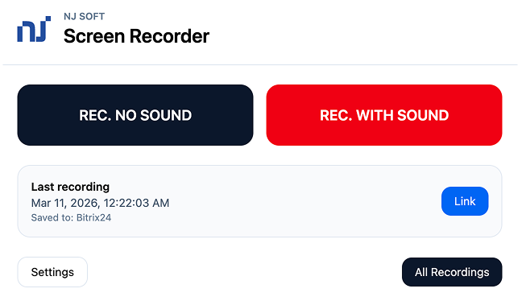
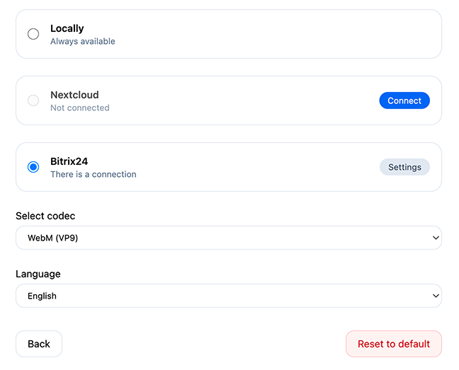

# RU
## Расширение для записи экрана
Данное расширение устанавливается в браузер (chrome, chromium) и позволяет записывать экран, и сохранять записи локально или на своё облако в `Nextcloud`.

## Как установить ?

1. Скачать репозиторий (`git clone`) или архив репозитория (`zip` и распаковать его).
2. В браузере открыть управление расширениями `chrome://extensions/` и включить `Режим разработчика`, затем нажать на кнопку `Загрузить распакованное расширение`
3. Выбрать распакованную или склонированную папку расширения
4. Для настройки соединения с вашим `Nextcloud` сервером, нужно нажать на кнопку `Настройки` и заполнить форму.

### Как это работает?

Расширение использует [MediaStream recording API](https://developer.mozilla.org/en-US/docs/Web/API/MediaStream_Recording_API) и библиотеку [ts-ebml](https://github.com/legokichi/ts-ebml) для добавления информации длительности видеофайла после завершения записи.

# EN
## Screencast
This extension setup in browser (chrome, chromium) and save video files to local host or to `Nextcloud` instance.

## How to install ?

1. Do `git clone` or `download zip` (if it zip then unpack it)
2. In your browser open `chrome://extensions/` and enable `developer mode` then `load unpacked`
3. Select unpacked (or cloned) dir and `pin` it from extensions icon near omnibox.
4. To setup `nextcloud uploading` click on extension icon and click `Settings` and fill the form.

### How it works?

Extension uses [MediaStream recording API](https://developer.mozilla.org/en-US/docs/Web/API/MediaStream_Recording_API) and library [ts-ebml](https://github.com/legokichi/ts-ebml) for extract duration information after finish capture.

### Скриншоты / Screenshots

### If you like it and want to say thanks, [donations](https://donate.stripe.com/3cseYI2OQ8J0aOI288) are welcome.