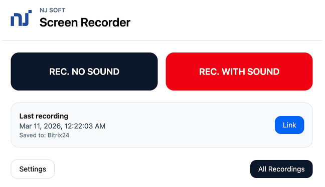
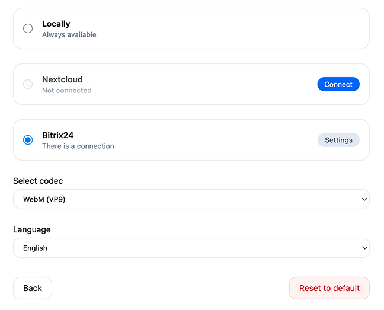
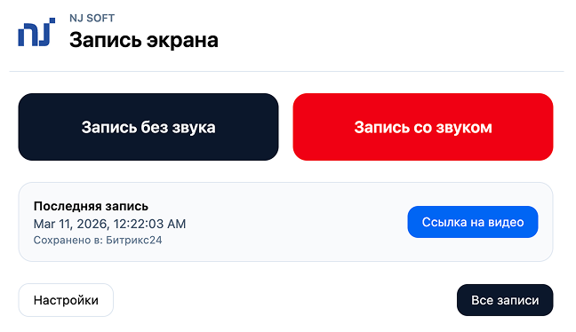
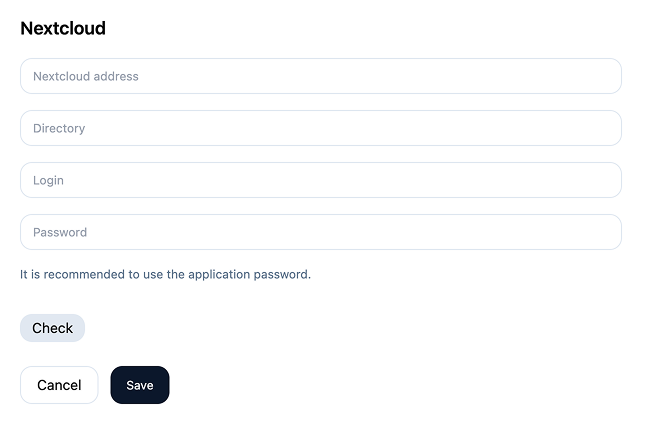

# NJ Screencast

Chrome extension for screen recording: record desktop with or without sound, choose codec, save locally or upload to Nextcloud / Bitrix24. Free and open source.

---

## Features

- **Recording**: Desktop capture with or without microphone; pause and resume.
- **Formats**: WebM (VP8, VP9, H.264), MP4 (H.264).
- **Save destinations**:
  - **Local** — file stays in the browser (download via extension).
  - **Nextcloud** — upload via WebDAV (application password recommended).
  - **Bitrix24** — upload to Drive via incoming webhook (personal or shared).
- **Archive**: All recordings are stored in history; add notes and delete entries.
- **UI**: Interface in English or Russian (select in Settings).

---

## Install

### From Chrome Web Store

[Install NJ Screencast](https://chromewebstore.google.com/detail/nj-screencast-%D0%B7%D0%B0%D0%BF%D0%B8%D1%81%D1%8C-%D1%8D%D0%BA%D1%80%D0%B0/lpahdblhaaaociedcbjkaechgehhlogh)

### From source

1. Clone or download the repo and go to the project folder.
2. Run: `npm install && npm run build`
3. Open [chrome://extensions](chrome://extensions), turn on **Developer mode**, click **Load unpacked**.
4. Select the project folder (with built `popup.html` and assets).

**Development**: run `npm run dev` to rebuild on file changes.

---

## Setup

- Click the extension icon → **Settings**.
- **Save destination**: Local, Nextcloud, or Bitrix24. For Nextcloud/Bitrix24 use **Connect** (or **Settings** if already connected) and fill the form.
- **Nextcloud**: Use an [application password](https://docs.nextcloud.com/server/stable/user_management/personal_settings.html#security) (e.g. from `/settings/user/security`).
- **Bitrix24**: Use the incoming webhook URL (Applications → Incoming webhook). Optionally set drive type and folder name.
- **Video format** and **Language** (EN/RU) are saved in Settings. Use **Reset to default** to restore initial settings.

---

## How it works

- Recording uses the [MediaStream Recording API](https://developer.mozilla.org/en-US/docs/Web/API/MediaStream_Recording_API).
- Duration is fixed in the file using [EBML](https://github.com/legokichi/ts-ebml) after recording stops.
- Nextcloud uploads go over [WebDAV](https://docs.nextcloud.com/server/stable/developer_manual/client_apis/WebDAV/).
- Bitrix24 uploads use the REST API (webhook). History is kept in the extension’s local storage.

---

## Project structure

- **Popup** (React + Tailwind): `popup-src.html`, `src/Popup.jsx`, `src/main.jsx` — built with Vite to `popup.html` + assets.
- **Background**: `background.js` — starts the recorder tab and keeps recording state.
- **Recorder**: `recorder.html`, `recorder.js` — capture tab; `EBML.js` for WebM duration.
- **Locales**: `_locales/en`, `_locales/ru` — UI strings.
- **Build**: `npm run build` → `dist/` and popup files in project root; load the project (or `dist/`) as unpacked extension.

---

## Screenshots

| Main / Record | Settings |
|---------------|----------|
|  |  |

---

## Donations

[Donate via Stripe](https://donate.stripe.com/3cseYI2OQ8J0aOI288) if you want to support the project.

---

# NJ Screencast (рус.)

Расширение Chrome для записи экрана: запись с экрана и микрофона, выбор кодека, сохранение локально или выгрузка в Nextcloud / Битрикс24. Бесплатно и с открытым кодом.

## Возможности

- **Запись**: захват экрана с микрофоном или без; пауза и продолжение.
- **Форматы**: WebM (VP8, VP9, H.264), MP4 (H.264).
- **Куда сохранять**: локально, в Nextcloud (WebDAV) или в Битрикс24 (вебхук, Диск).
- **Архив**: все записи в истории, заметки к записям, удаление из списка.
- **Язык**: интерфейс на английском или русском (в Настройках).

## Установка из репозитория

1. Клонировать или скачать репозиторий, перейти в папку проекта.
2. Выполнить: `npm install && npm run build`
3. Открыть [chrome://extensions](chrome://extensions), включить **Режим разработчика**, нажать **Загрузить распакованное расширение** и выбрать папку проекта.

**Разработка**: команда `npm run dev` — пересборка при изменении файлов.

## Настройка

- Иконка расширения → **Настройки**.
- Пункт **Сохранять запись**: локально, Nextcloud или Битрикс24. Для Nextcloud/Битрикс24 — **Подключить** (или **Настройки** при уже настроенном подключении) и заполнить форму.
- Nextcloud: использовать [пароль приложения](https://docs.nextcloud.com/server/stable/user_management/personal_settings.html#security).
- Битрикс24: URL входящего вебхука (Приложения → Входящий вебхук), при необходимости — тип диска и папка.
- В настройках сохраняются формат видео и язык; **Сбросить по умолчанию** восстанавливает начальные значения.

Страница расширения: https://njsoft.dev/solutions/nj-screencast/

## Скриншоты

| Главный экран / запись | Настройки |
|------------------------|-----------|
|  |  |
